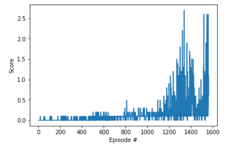
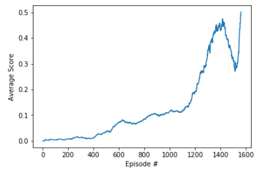

# Deep Reinforcement Learning Nanodegree - Project 3: Collaboration and Competition

## Introduction
The problem to be solved here is to train 2 agents to play tennis in the Unity environment.Each agent will control a racket to bounce a ball over the net, and if the agent hits the ball over it, it receives a reward of +0.1, whilst if not it receives -0.01.

The space consists of 8 variables which describe the position and velocity of the ball and racket, receiving each agent its own local observation of this.

The available actions are two continuous ones: move toward or away the net, and jumping.

With respect to the training method, MADDGP is chosen, which make use of 2 DDPG agents. Moreover, a Replay Buffer is used between the agents. Both the actor and critic are made by 2 fully connected layers with 200 and 150 units each, and the Replay Buffer a fixed buffer size of 100000. Other hyperparameters are:
- Batch size = 250
- Gamma = 0.99
- Tau = 0.001
- LR_actor = 0.0001
- LR_critic = 0.001
- Weight_decay = 0

## Results
The aiming of the project was to reach an average of rewards of 0.5, and this is reached in 1561 episodes, as it can be seen in the following Figure:

As it can be seen, the agent trained very slowly at the beginning, but after 1000 episodes it learned faster, and after a noticeable decrease of average score, it jumped at the end to reach the objective.

## Future Improvements
Although the objective proposed for the project has been achieved, this can be highly improved, and here some future improvements are proposed:
1. More layers in the Neural Network
2. Increase the batch size to have a more frequent update of the Nerwork
3. Try other models such as Proximal Policy Optimization, Asynchronous Actor Critic Agent or Multi-Agent DQN.
